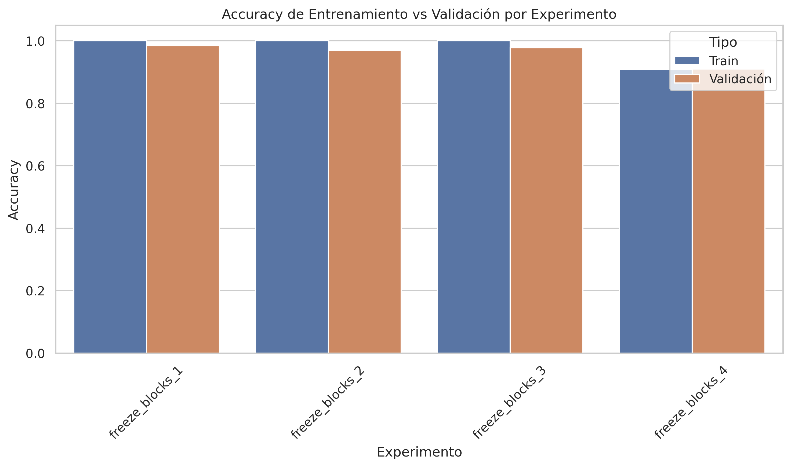
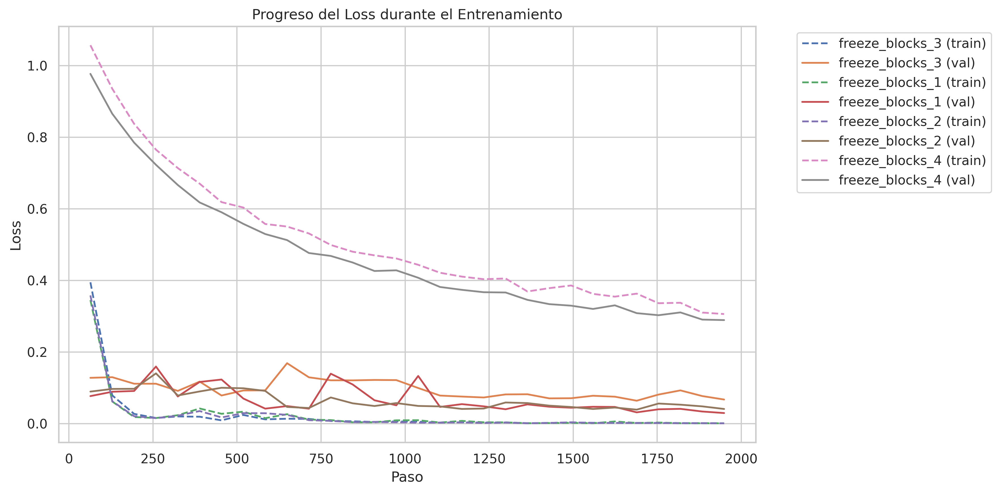
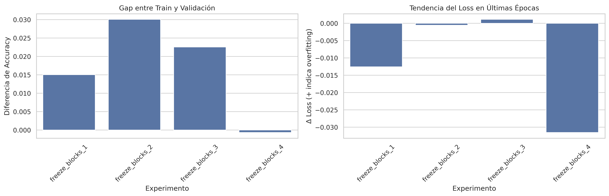
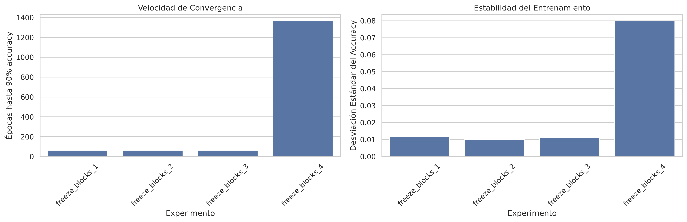
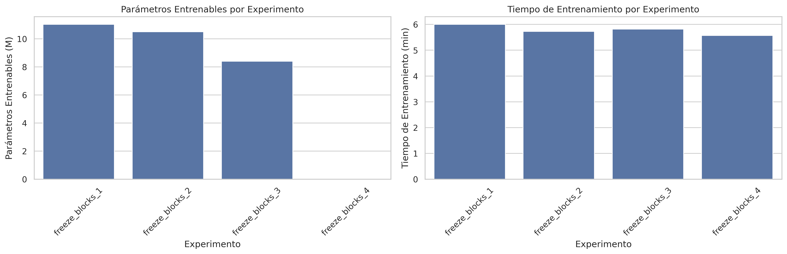
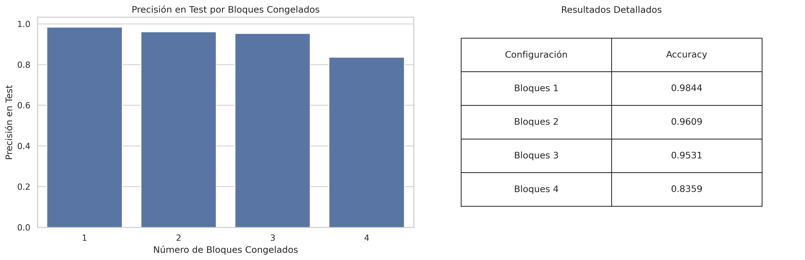

# Optimizar Clasificación de Beans mediante Congelamiento Selectivo en ResNet18

## Descripción / Abstract

Este estudio desafía la creencia común de que entrenar todos los parámetros de un modelo preentrenado conduce necesariamente a mejores resultados. Utilizando una única arquitectura ResNet18, investigamos cómo el congelamiento estratégico de diferentes bloques puede mantener o incluso mejorar el rendimiento mientras se reduce significativamente el número de parámetros entrenables y los recursos computacionales necesarios. El objetivo es demostrar que una configuración más eficiente de los parámetros entrenables puede lograr resultados comparables o superiores, optimizando así el uso de recursos computacionales sin comprometer el rendimiento.

---

## Introducción

Si bien históricamente existió una tendencia a utilizar todos los parámetros disponibles en modelos preentrenados, actualmnete es bien conocida la importancia crítica de la eficiencia computacional. Este cambio de paradigma está impulsado por la necesidad de democratizar el acceso a los modelos de aprendizaje profundo, haciéndolos más accesibles y prácticos para su implementación en servicios del mundo real. 

Esta tendencia hacia la democratización se refleja en el desarrollo de diversas técnicas de optimización como:
- **LoRA** (Low-Rank Adaptation), que permite el fine-tuning eficiente mediante la factorización de matrices
- **Destilación de conocimiento** para crear modelos más compactos
- **Cuantización de pesos** para reducir los requisitos de memoria y acelerar la inferencia

En este contexto, el estudio utiliza la ResNet18 como caso de estudio para demostrar que, mediante el congelamiento selectivo de capas, podemos reducir significativamente la cantidad de parámetros entrenables mientras mantenemos o mejoramos el rendimiento del modelo.

La optimización de recursos sin comprometer el rendimiento se ha convertido en un factor crucial para hacer que las soluciones de inteligencia artificial sean verdaderamente escalables y accesibles para todo el mundo, desde pequeñas empresas hasta aplicaciones de gran escala.

---

## Metodología/Modelo

### Dataset 📊

El estudio utiliza el dataset "Beans" proporcionado por AI-Lab-Makerere a través de HuggingFace, que consiste en imágenes de plantas de frijol para clasificación. Los datos se procesan mediante un pipeline de transformaciones que incluye:

- 🔄 Redimensionamiento de imágenes a 224x224 píxeles
- 📊 Normalización utilizando los valores estándar de ImageNet:
  - mean=[0.485, 0.456, 0.406]
  - std=[0.229, 0.224, 0.225]
- 🔢 Transformación a tensores para su procesamiento en PyTorch

El dataset se divide en tres conjuntos: entrenamiento, validación y test, manteniendo la estructura original proporcionada por los autores.

### Arquitectura del Modelo 🏗️

Se utiliza una ResNet18 pre-entrenada en ImageNet (IMAGENET1K_v1) como modelo base, modificada para la tarea de clasificación específica:

- **Modelo base**: ResNet18 con pesos pre-entrenados
- **Capa de clasificación**: Adaptada para 3 clases (correspondientes a las categorías de plantas de frijol)
- **Estrategia de congelamiento**: Implementación de congelamiento selectivo por bloques, permitiendo experimentar con diferentes configuraciones de parámetros entrenables

### Proceso de Entrenamiento ⚙️

#### Configuración Base:
| Parámetro | Valor |
|-----------|--------|
| Batch size | 16 |
| Learning rate | 1e-4 |
| Max epochs | 30 |
| Workers | 4 |

#### Elementos de la estrategia de training:
- ✅ Callback para guardar checkpoints con filtro en val_loss con pacience = 10
- 🛑 Early stopping con filtro en val_loss con pacience = 10
- 📊 Logger para TensorBoard
- ⚙️ Declaracacion del trainer con:
  - Precisión mixta para optimizar memoria y velocidad
  - Compatibilidad con GPU (Nvidia T4 de Google Colab)
  - deterministic=True para asegurar reproducibilidad
  - log_every_n_steps=10 para registrar métricas cada 10 steps

#### Decisiones de diseño:
- 📈 Uso de tensorboard para registrar métricas y visualizaciones
- ⚡ Uso de pytorch-lightning para agilizar el desarrollo
- 🎯 Epochs limitadas a 30 con early stopping para prevenir overfitting

---

## Resultados
### 📊 Análisis Experimental de Resultados

#### 1. Rendimiento del Modelo 🎯

##### 1.1 Accuracy de Entrenamiento y Validación

> Puesto que se trata de un problema de clasificación sencillo, hasta la congelación de la mayoría del modelo rinde excepcionalmente bien. Esto se ha hecho para remarcar aún más el hecho de que no necesitamos hacer full-finetunings ni grandes entrenamientos para obtener resultados notables. Incluso se puede ver que a partir de la congelación de los dos últimos bloques el rendimiento extra es residual.

##### 1.2 Evolución del Loss Durante el Entrenamiento

> La visualización del loss durante el entrenamiento es bastante ilustrativa. Puesto que se trata de un problema de clasificación sencilla, el modelo converge rápidamente. Además, se puede ver cómo el loss durante la validación es bastante estable y se mantiene parejo al del training, dándonos a entender que no estamos sufriendo de overfitting.

#### 2. Análisis de Generalización 🔍

##### 2.1 Estudio de Overfitting

> La gráfica de análisis de overfitting muestra claramente que no hay un overfitting latente en el modelo. El que más indicios de generalización muestra es el modelo de 4 bloques congelados puesto que tiene que lidiar con todo un "forward pass" de 4 bloques de ResNet18 sin ningún parámetro entrenable.

##### 2.2 Análisis de Convergencia

> Como es natural, cuanto más parámetros más rápido va a converger el modelo. Le va a costar muy poco encontrar un óptimo, todo lo contrario al modelo de 4 bloques congelados cuya convergencia es más lenta. La desviación estándar del 4 es más alta, sus steps son más abruptos.

#### 3. Eficiencia Computacional ⚡

##### 3.1 Relación Parámetros-Tiempo

> Esto ejemplifica muy bien cómo el experimento al ser pequeño, se da la dicotomía entre los tiempos similares de entrenamiento y el número de parámetros entrenables.
> Puesto que el cuello de botella no está en el training, sino en el batch size y los dataloaders. Esto hace que usar una GPU para problemas pequeños no sea una buena inversión de recursos.

#### 4. Resultados Finales 🎯

##### 4.1 Rendimiento en Test

> Es de esperar que el modelo de 4 bloques congelados tenga el menor accuracy puesto que es el que menos parámetros entrenables tiene. Además, se puede ver cómo el modelo de 1 bloque congelado rinde casi igual que el de 2 y 3, nos da a pensar que no compensa usar más parámetros entrenables, solo los necesarios.

## Conclusiones

Los resultados obtenidos en este estudio respaldan firmemente nuestra hipótesis inicial sobre la optimización de recursos mediante el congelamiento selectivo de capas en arquitecturas preentrenadas. A través de una serie de experimentos sistemáticos con ResNet18, hemos demostrado que no es necesario entrenar todos los parámetros del modelo para obtener un rendimiento óptimo en tareas de clasificación específicas.

El análisis detallado de diferentes configuraciones de congelamiento reveló que podemos mantener un accuracy bueno para este caso de uso (superior al 95%) incluso cuando congelamos hasta tres bloques del modelo. Este hallazgo es particularmente significativo desde la perspectiva de la eficiencia computacional y la optimización de recursos. La degradación significativa del rendimiento solo se observó al congelar cuatro bloques, lo que sugiere un punto de equilibrio claro entre la reducción de parámetros entrenables y el mantenimiento del rendimiento.

Un aspecto especialmente relevante del experimento es la estabilidad del entrenamiento y la ausencia de overfitting en todas las configuraciones probadas. Los modelos mostraron una convergencia saludable y una generalización robusta, como se evidencia en las métricas de validación y test. Esto sugiere que el congelamiento selectivo no solo optimiza recursos, sino que también puede contribuir a una mejor generalización del modelo.

La relación entre el tiempo de entrenamiento y el número de parámetros reveló una perspectiva interesante sobre la eficiencia computacional en problemas de escala moderada. Observamos que, para datasets relativamente pequeños, el cuello de botella principal no reside en el proceso de entrenamiento sino en la gestión de datos, lo que cuestiona la necesidad de recursos computacionales intensivos como GPUs para problemas similares.

Estos resultados tienen implicaciones significativas para la democratización del aprendizaje profundo, alineándose con la tendencia actual hacia técnicas de optimización como LoRA y la destilación de conocimiento. Nuestro enfoque demuestra que es posible implementar soluciones eficientes y efectivas sin necesidad de recursos computacionales extensivos, haciendo que las aplicaciones de deep learning sean más accesibles para un espectro más amplio de usuarios y casos de uso.

